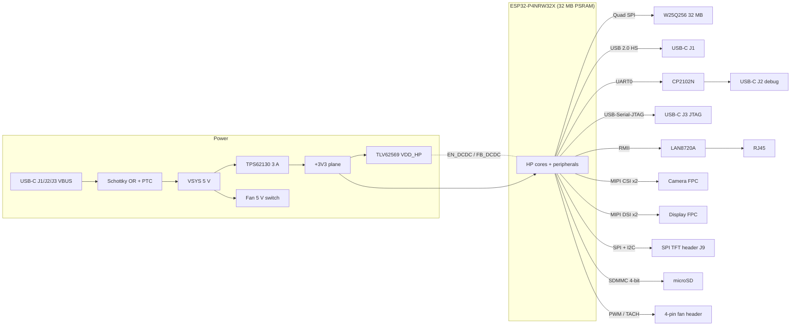

# ESP32-P4 "Extreme Performance" development board

[](https://github.com/Andreuxxx1977/esp32-p4/actions/workflows/ci.yml)
[](LICENSE)

An open-hardware, actively cooled ESP32-P4 board for heavy multimedia work: a 2-lane MIPI camera,
a 2-lane MIPI display, USB 2.0 High-Speed, 10/100 Ethernet, UHS-I microSD, 32 MB flash and
32 MB PSRAM. It uses a 4-layer HDI PCB, a 3 A 3.3 V rail, and a heatsink + PWM fan over the SoC.

> **Status: design data complete, PCB layout in progress.**
> The schematic-level design is finished and machine-checked: parts, pinout, netlist, BOM and docs.
> Component placement is being scripted. Routing, Gerbers, fabrication and bench testing have
> **not** been done yet. Check [Project status](#project-status) before ordering anything.

> **Resumen en español:** placa de desarrollo abierta con ESP32-P4, refrigeración activa, cámara y
> pantalla MIPI, USB-HS, Ethernet y microSD. Todos los archivos se generan desde un único modelo en
> Python. Libre de usar citando este proyecto como original (ver [Licencia](#license-free-to-use-just-credit-the-original-project)).

---

## Download the files

Everything is in this repository. Download all of it as a ZIP with
**[Download ZIP](https://github.com/Andreuxxx1977/esp32-p4/archive/refs/heads/main.zip)**, or open any
file below and use GitHub's "Download raw file" button.

| What you want | File | Notes |
|---|---|---|
| **PCB (KiCad board)** | `hardware/output/esp32p4_extreme.kicad_pcb` | **Not published yet.** A placed but *unrouted* KiCad 9 board is being generated and will appear here. Until then, use the netlist below. |
| **Netlist** (import into KiCad) | [`hardware/output/esp32p4_extreme.net`](hardware/output/esp32p4_extreme.net) | 231 parts, 175 nets, all footprints assigned. In KiCad: *PCB Editor -> File -> Import -> Netlist*. |
| **Bill of materials for PCBWay** | [`hardware/output/bom_pcbway.csv`](hardware/output/bom_pcbway.csv) and [`docs/TASK4_bom_pcbway.md`](docs/TASK4_bom_pcbway.md) | Turnkey format: designator, qty, value, package, MPN, manufacturer, LCSC #. |
| **Pinout / architecture** | [`docs/TASK1_pinout.md`](docs/TASK1_pinout.md) | All 55 GPIOs, dedicated pads, and a proof that the peripherals don't collide. |
| **Mechanical & thermal plan** | [`docs/TASK2_mechanical_thermal.md`](docs/TASK2_mechanical_thermal.md) | Heatsink/fan stack, thermal numbers, hole and connector coordinates. |
| **Why each part was chosen** | [`docs/component_verification.md`](docs/component_verification.md) | Evidence (distributor/datasheet links) for every MPN and pinout. |
| **Connection list** (spreadsheet) | [`hardware/output/esp32p4_extreme_nets.csv`](hardware/output/esp32p4_extreme_nets.csv) | One row per pad: net, net class, reference, pad. |

## What's on the board

| Block | Implementation |
|---|---|
| SoC | **ESP32-P4NRW32X**: dual-core RISC-V up to 400 MHz, chip rev v3.x, 32 MB PSRAM in-package |
| Flash | 32 MB Quad-SPI NOR, Winbond **W25Q256JVEIQ** (3.3 V) |
| Power | USB-C VBUS (any of 3 ports, Schottky OR-ed) -> **TPS62130** 3 A buck -> 3.3 V; **TLV62569** buck for the SoC core rail (`VDD_HP`), enabled and trimmed by the SoC itself |
| USB 1 (J1) | Native USB 2.0 **High-Speed** OTG (480 Mbit/s) on the SoC's dedicated PHY, **TPD2EUSB30** 0.7 pF ESD |
| USB 2 (J2) | Debug console: **CP2102N** USB-UART with automatic download/reset (DTR/RTS) |
| USB 3 (J3) | Native **USB-Serial-JTAG**: JTAG debugging + flashing with no drivers or setup |
| Ethernet | 10/100 RMII PHY **LAN8720A** + HanRun **HR911105A** RJ45 with magnetics |
| Camera | 2-lane MIPI CSI-2, 22-pin 0.5 mm FPC (**Raspberry Pi 5 pinout**; same Amphenol connector as the Pi) |
| Display | 2-lane MIPI DSI, same 22-pin FPC (J_DSI) + 5 V backlight JST-SH (J8), **plus** a 2x8 2.54 mm header (J9) for common SPI TFTs (ST7789 / ILI9341 / ST7735, with or without touch) |
| Storage | microSD on the UHS-I-capable SDMMC slot 0, 4-bit, 1.8/3.3 V switching, 0.5 pF TVS arrays |
| Cooling | 25 x 25 mm heatsink on the SoC, clamped through **4x M2.5 holes at (+/-15, +/-15) mm**; 5 V 4-wire PWM fan header; 7x7 filled thermal-via array under the SoC |
| Expansion | 2x12 2.54 mm header (J6): 20 GPIOs, LP-UART, ADC, pad-JTAG, I2C, 3V3/5V |
| Board | 110 x 80 mm, 4-layer HDI (1+2+1), 1.6 mm, controlled impedance 50 / 90 / 100 ohm |



## Project status

| Step | State |
|---|---|
| Architecture, GPIO map, zero-conflict check | Done: [`docs/TASK1_pinout.md`](docs/TASK1_pinout.md) |
| Part selection with sourcing evidence | Done: [`docs/component_verification.md`](docs/component_verification.md) |
| Netlist (SKiDL), ERC 0 errors / 0 warnings, independent verification | Done |
| Every pad cross-checked against the real KiCad footprints | Done |
| PCBWay BOM | Done: 63 fitted lines, 219 placements (215 SMD + 4 THT), single-sided top assembly |
| Mechanical/thermal plan | Done: [`docs/TASK2_mechanical_thermal.md`](docs/TASK2_mechanical_thermal.md) |
| Component placement (pcbnew script + downloadable `.kicad_pcb`) | **In progress** |
| Routing, DRC in KiCad, Gerbers | Not started |
| Fabrication, bring-up, firmware | Not started |

Open items to confirm against datasheets before ordering are listed at the end of
[`docs/component_verification.md`](docs/component_verification.md) (items marked UNVERIFIED).

## How the repository works

**One Python file describes the whole board**, and everything else is generated from it:

```
hardware/lib/board_spec.py       <- the design: parts, MPNs, footprints, every connection, placement
hardware/lib/esp32p4_pinout.py   <- ESP32-P4 pad table and IO_MUX rules (from Espressif sources)
hardware/lib/impedance.py        <- stack-up and 50/90/100 ohm trace geometry
        |
        +--> hardware/skidl/esp32p4_extreme_netlist.py  -> hardware/output/esp32p4_extreme.net (+ nets CSV, ERC log)
        +--> hardware/pcbnew/                            -> board placement (work in progress)
        +--> tools/gen_docs.py                           -> docs/TASK1_*.md, TASK2_*.md, TASK4_*.md, bom_pcbway.csv
        +--> tests/                                      -> 53 automated design checks
```

So the pinout table, the netlist and the BOM can never disagree. To change the board, edit
`board_spec.py` and regenerate (see [CONTRIBUTING.md](CONTRIBUTING.md)).

### Run the checks yourself

```bash
pip install --use-pep517 -r requirements.txt
python -m hardware.lib.board_spec                  # validate the design data
python -m hardware.skidl.esp32p4_extreme_netlist   # netlist + ERC  -> hardware/output/
python -m hardware.skidl.verify_netlist            # netlist == spec, pad by pad
python -m hardware.skidl.check_footprints          # pads exist in the real KiCad footprints (needs internet)
python -m tools.gen_docs                           # regenerate docs + BOM (--check to only verify)
python -m pytest -q
```

GitHub Actions runs the same steps on every push and pull request (see [`.github/workflows/ci.yml`](.github/workflows/ci.yml)).
The KiCad footprint names target the **KiCad 9/10** standard libraries. The SoC footprint comes from
[Espressif's KiCad library](https://github.com/espressif/kicad-libraries) (`PCM_Espressif:ESP32-P4`).

## Design decisions that differ from a "typical" P4 board

All of these come from Espressif's primary sources: the ESP-IDF `soc_caps.h`/`*_pins.h`/`emac_periph.c`
files, the ESP32-P4 hardware design guidelines and Espressif's KiCad library.

| Asked for | Built | Why |
|---|---|---|
| ESP32-P4NR32 | **ESP32-P4NRW32X** (rev v3.x, 32 MB PSRAM) | The orderable 32 MB-PSRAM part. Espressif marks rev v1.x as not recommended for new designs. |
| 32 MB **Octal** flash (MX25UM25645G) | 32 MB **Quad** W25Q256JVEIQ (3.3 V) | The P4 flash interface is SPI/Dual/Quad only, up to 64 MB. ESP-IDF has no octal-flash capability for the P4. MX25UM is also 1.8 V, while the P4 flash rail defaults to 3.3 V. |
| MP2315 / SY8113B buck | **TPS62130** (3-17 V, 3 A, 100 % duty) | Works from Schottky-OR-ed VBUS (~4.4-4.6 V), below the MP2315's 4.5 V minimum. The exposed pad is also better thermally at 3 A. |
| (not asked) | **TLV62569** VDD_HP DCDC | The P4 core rail must come from an external DCDC that the SoC enables and trims itself. TLV62569 is on Espressif's verified list. |
| RTL8201F | **LAN8720A** | Pinout verified from the official KiCad library, ESP-IDF `lan87xx` driver. Its REF_CLK-out mode feeds the P4's input-only RMII clock. |
| CH340K / CP2102N "UART/JTAG" | **CP2102N** (UART) **plus** a 3rd USB-C on the P4's native USB-Serial-JTAG | Neither chip can do JTAG. The P4's built-in USB-Serial-JTAG gives JTAG with no setup. |
| USBLC6-2SC6 on USB-HS | **TPD2EUSB30** on J1 (USBLC6 kept on J2/J3) | USBLC6 is 3.5 pF max. Espressif requires at most 1 pF on the High-Speed lines. |
| AO3400A fan MOSFET | AO3400A as **open-drain PWM** + AO3401A high-side switch | A 4-wire fan needs constant power and an open-drain PWM input (Intel spec). The fan runs at 100 % if the firmware hangs, and can be switched off completely. |

## Contributing

Issues and pull requests are welcome. Reviews of the schematic choices, routing help and bring-up
reports are the most useful right now. Read [CONTRIBUTING.md](CONTRIBUTING.md) first: in short,
edit `hardware/lib/board_spec.py`, regenerate, and commit the generated files with it.

## License: free to use, just credit the original project

Copyright (c) 2026 Andreuxxx1977. Licensed under the **CERN Open Hardware Licence v2 - Permissive**
(SPDX: `CERN-OHL-P-2.0`). The full text is in [`LICENSE`](LICENSE).

In plain words: **anyone is free to use, copy, modify, fabricate, sell and build on this design,
commercially or not.** The only thing asked in return is that you **credit this project as the
original**, for example with a link in your README, documentation or product page:

> Based on the ESP32-P4 Extreme Performance board by Andreuxxx1977 -
> https://github.com/Andreuxxx1977/esp32-p4

You don't have to publish your own changes, and you don't have to use the same licence for your
derivative. That attribution line is the licence's "Notice", so keep it (CERN-OHL-P v2 section 3.2).
If you modify the design, add a short note saying so (section 3.3).

Why so permissive? This design was produced largely with an AI assistant (Claude Code) driving the
research, the data model and the generated files. There's little personal merit to protect, so the goal
is simply that it's useful to as many people as possible.

**Libre de usar:** cualquiera puede usar, modificar, fabricar y vender este diseño. Lo único que se pide
es mencionar que el proyecto original es https://github.com/Andreuxxx1977/esp32-p4.

This source is distributed WITHOUT ANY EXPRESS OR IMPLIED WARRANTY, INCLUDING OF MERCHANTABILITY,
SATISFACTORY QUALITY AND FITNESS FOR A PARTICULAR PURPOSE. Please see the CERN-OHL-P v2 for applicable
conditions. The board has not been fabricated or bench-tested yet. Treat it as a reviewed starting point
and check it against the datasheets before ordering (see `docs/component_verification.md`).
