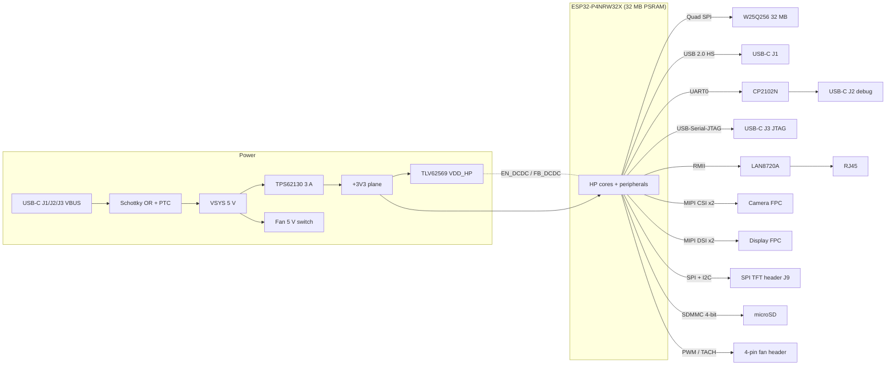

# ESP32-P4 "Extreme Performance" development board

[](https://github.com/Andreuxxx1977/esp32-p4/actions/workflows/ci.yml)
[](LICENSE)

An open-hardware, actively cooled ESP32-P4 board for heavy multimedia work: a 2-lane MIPI camera,
a 2-lane MIPI display, USB 2.0 High-Speed, 10/100 Ethernet, UHS-I microSD, 32 MB flash and
32 MB PSRAM. It uses a 4-layer HDI PCB, a 3 A 3.3 V rail, and a heatsink + PWM fan over the SoC.

> **Status: design complete and placed; routing not started.**
> Parts, pinout, netlist, BOM, docs and the **placed KiCad 10 board** are finished and machine-checked
> (KiCad DRC: 0 errors). Routing, Gerbers, fabrication and bench testing have **not** been done yet.
> Check [Project status](#project-status) before ordering anything.

| Top | Bottom |
|---|---|
|  |  |

*Rendered by KiCad 10 in CI from the committed board on every push to `main` (published to the
[`renders`](https://github.com/Andreuxxx1977/esp32-p4/tree/renders) branch). Placed, not yet routed. The
RJ45 and FPC connectors have no model in KiCad's 3D library, so they show as footprints. The ESP32-P4
body is a representative 10 x 10 mm QFN (Espressif ships no 3D model).*

> **Resumen en español:** placa de desarrollo abierta con ESP32-P4, refrigeración activa, cámara y
> pantalla MIPI, USB-HS, Ethernet y microSD. Todos los archivos se generan desde un único modelo en
> Python. Libre de usar citando este proyecto como original (ver [Licencia](#license-free-to-use-just-credit-the-original-project)).

## How this project was made: about 95 % by an AI agent

This board is an experiment in AI-driven hardware design. **Roughly 95 % of the work in this repository
was done by [Claude Code](https://claude.com/claude-code), Anthropic's AI coding agent**, working
from a written brief. It did the component research and part selection, the ESP32-P4 pin-mux
analysis, the Python data model, the SKiDL netlist, the KiCad placement and routing scripts, the BOM,
the documentation, the tests and the CI that checks all of it.

The remaining ~5 % is human, by the repository owner: writing the brief, making the decisions the
agent asked for (licence, double-sided assembly, adding a display connector), and reviewing and
merging every change.

What that means for you:

- **Everything that can be checked by a machine is checked**, on every commit, with the real KiCad
  tools (see [Verification](#verification-what-github-checks-on-every-commit)). Every part number and
  pinout has a source link in [`docs/component_verification.md`](docs/component_verification.md).
- **What a machine can't prove is listed as open**: datasheet fine print marked UNVERIFIED, signal
  integrity of the high-speed links, thermal behaviour, and whether the board works on the bench.
  No experienced hardware engineer has reviewed it yet, and it has not been fabricated.
- Treat it as a well-documented starting point, not a proven product. Reviews and bring-up reports
  are very welcome.

> **En español:** alrededor del **95 % de este proyecto lo ha hecho Claude Code**, el agente de
> programación con IA de Anthropic, a partir de un enunciado escrito: investigación y elección de
> componentes, pinout, netlist, colocación y enrutado en KiCad, BOM, documentación, tests y CI. El
> ~5 % restante es humano: el enunciado, las decisiones que el agente pidió y la revisión y fusión de
> cada cambio. Todo lo comprobable automáticamente se comprueba en cada commit; lo que no (integridad
> de señal, térmica, funcionamiento real) está marcado como pendiente. Aún no se ha fabricado.

---

## Download the files

Everything is in this repository. Download all of it as a ZIP with
**[Download ZIP](https://github.com/Andreuxxx1977/esp32-p4/archive/refs/heads/main.zip)**, or open any
file below and use GitHub's "Download raw file" button.

| What you want | File | Notes |
|---|---|---|
| **PCB: KiCad 10 project** (open the `.kicad_pro`) | [`hardware/output/esp32p4_extreme.kicad_pro`](hardware/output/esp32p4_extreme.kicad_pro) + [`esp32p4_extreme.kicad_pcb`](hardware/output/esp32p4_extreme.kicad_pcb) + [`esp32p4_extreme.kicad_dru`](hardware/output/esp32p4_extreme.kicad_dru) | **All parts placed, not routed yet** (ratsnest only). Stack-up, net classes, diff pairs, zones, thermal vias, keep-outs and custom DRC rules are set up. Download all three files into one folder. Opens in KiCad 9 and 10. |
| **Netlist** (import into KiCad) | [`hardware/output/esp32p4_extreme.net`](hardware/output/esp32p4_extreme.net) | 231 parts, 175 nets, all footprints assigned. In KiCad: *PCB Editor -> File -> Import -> Netlist*. |
| **Bill of materials for PCBWay** | [`hardware/output/bom_pcbway.csv`](hardware/output/bom_pcbway.csv) and [`docs/TASK4_bom_pcbway.md`](docs/TASK4_bom_pcbway.md) | Turnkey format: designator, qty, value, package, MPN, manufacturer, LCSC #. |
| **Pinout / architecture** | [`docs/TASK1_pinout.md`](docs/TASK1_pinout.md) | All 55 GPIOs, dedicated pads, and a proof that the peripherals don't collide. |
| **Mechanical & thermal plan** | [`docs/TASK2_mechanical_thermal.md`](docs/TASK2_mechanical_thermal.md) | Heatsink/fan stack, thermal numbers, hole and connector coordinates. |
| **Why each part was chosen** | [`docs/component_verification.md`](docs/component_verification.md) | Evidence (distributor/datasheet links) for every MPN and pinout. |
| **Connection list** (spreadsheet) | [`hardware/output/esp32p4_extreme_nets.csv`](hardware/output/esp32p4_extreme_nets.csv) | One row per pad: net, net class, reference, pad. |

## What's on the board

| Block | Implementation |
|---|---|
| SoC | **ESP32-P4NRW32X**: dual-core RISC-V up to 400 MHz, chip rev v3.x, 32 MB PSRAM in-package |
| Flash | 32 MB Quad-SPI NOR, Winbond **W25Q256JVEIQ** (3.3 V) |
| Power | USB-C VBUS (any of 3 ports, Schottky OR-ed) -> **TPS62130** 3 A buck -> 3.3 V; **TLV62569** buck for the SoC core rail (`VDD_HP`), enabled and trimmed by the SoC itself |
| USB 1 (J1) | Native USB 2.0 **High-Speed** OTG (480 Mbit/s) on the SoC's dedicated PHY, **TPD2EUSB30** 0.7 pF ESD |
| USB 2 (J2) | Debug console: **CP2102N** USB-UART with automatic download/reset (DTR/RTS) |
| USB 3 (J3) | Native **USB-Serial-JTAG**: JTAG debugging + flashing with no drivers or setup |
| Ethernet | 10/100 RMII PHY **LAN8720A** + HanRun **HR911105A** RJ45 with magnetics |
| Camera | 2-lane MIPI CSI-2, 22-pin 0.5 mm FPC (**Raspberry Pi 5 pinout**; same Amphenol connector as the Pi) |
| Display | 2-lane MIPI DSI, same 22-pin FPC (J_DSI) + 5 V backlight JST-SH (J8), **plus** a 2x8 2.54 mm header (J9) for common SPI TFTs (ST7789 / ILI9341 / ST7735, with or without touch) |
| Storage | microSD on the UHS-I-capable SDMMC slot 0, 4-bit, 1.8/3.3 V switching, 0.5 pF TVS arrays |
| Cooling | 25 x 25 mm heatsink on the SoC, clamped through **4x M2.5 holes at (+/-15, +/-15) mm**; 5 V 4-wire PWM fan header; 7x7 filled thermal-via array under the SoC |
| Expansion | 2x12 2.54 mm header (J6): 20 GPIOs, LP-UART, ADC, pad-JTAG, I2C, 3V3/5V |
| Board | 110 x 80 mm, 4-layer HDI (1+2+1), 1.6 mm, controlled impedance 50 / 90 / 100 ohm |



## Project status

| Step | State |
|---|---|
| Architecture, GPIO map, zero-conflict check | Done: [`docs/TASK1_pinout.md`](docs/TASK1_pinout.md) |
| Part selection with sourcing evidence | Done: [`docs/component_verification.md`](docs/component_verification.md) |
| Netlist (SKiDL), ERC 0 errors / 0 warnings, independent verification | Done |
| Every pad cross-checked against the real KiCad footprints | Done |
| PCBWay BOM | Done: 63 fitted lines, 219 placements (215 SMD + 4 THT); pick-and-place file generated by CI |
| Mechanical/thermal plan | Done: [`docs/TASK2_mechanical_thermal.md`](docs/TASK2_mechanical_thermal.md) |
| Component placement: pcbnew script + downloadable KiCad 10 project | Done: 234 footprints, KiCad 10 DRC 0 errors, **double-sided** (8 x 0402 decoupling under the SoC on the bottom) |
| Routing, DRC in KiCad, Gerbers | Not started |
| Fabrication, bring-up, firmware | Not started |

## Verification: what GitHub checks on every commit

Every push and pull request runs [`Design checks`](https://github.com/Andreuxxx1977/esp32-p4/actions/workflows/ci.yml)
(badge at the top). Nothing is merged unless it passes. The results are public in the **Actions** tab.

| CI job | What it proves |
|---|---|
| **Spec, netlist, docs and tests** | The design data passes its rules: no GPIO used twice, IO_MUX-only signals on legal pads, boot straps safe, heatsink/standoff keep-outs respected. The committed netlist matches the design pad by pad. A fresh SKiDL netlist passes ERC with 0 errors and 0 warnings. The docs and BOM are not stale. The 57 unit tests pass. |
| **Pads exist in the real KiCad footprints** | Every connected pad exists in the official KiCad **10.0.6** footprint library. |
| **KiCad 10 (pcbnew API, DRC, render, centroid)** | Runs the real KiCad 10 in its [official Docker image](https://hub.docker.com/r/kicad/kicad). It rebuilds the board from scratch with the pcbnew placement script. Both that board and the committed one must pass KiCad's DRC with 0 errors (unconnected items are tolerated until routing). It also renders the board in 3D with the parts' models and exports the PCBWay pick-and-place file. Download these under *Artifacts* on the run page. |

Open items to confirm against datasheets before ordering are listed at the end of
[`docs/component_verification.md`](docs/component_verification.md) (items marked UNVERIFIED).

## How the repository works

**One Python file describes the whole board**, and everything else is generated from it:

```
hardware/lib/board_spec.py       <- the design: parts, MPNs, footprints, every connection, placement
hardware/lib/esp32p4_pinout.py   <- ESP32-P4 pad table and IO_MUX rules (from Espressif sources)
hardware/lib/impedance.py        <- stack-up and 50/90/100 ohm trace geometry
        |
        +--> hardware/skidl/esp32p4_extreme_netlist.py  -> hardware/output/esp32p4_extreme.net (+ nets CSV, ERC log)
        +--> hardware/pcbnew/                            -> hardware/output/esp32p4_extreme.kicad_pro/.kicad_pcb/.kicad_dru
        +--> tools/gen_docs.py                           -> docs/TASK1_*.md, TASK2_*.md, TASK4_*.md, bom_pcbway.csv
        +--> tests/                                      -> 53 automated design checks
```

So the pinout table, the netlist and the BOM can never disagree. To change the board, edit
`board_spec.py` and regenerate (see [CONTRIBUTING.md](CONTRIBUTING.md)).

### Run the checks yourself

```bash
pip install --use-pep517 -r requirements.txt
python -m hardware.lib.board_spec                  # validate the design data
python -m hardware.skidl.esp32p4_extreme_netlist   # netlist + ERC  -> hardware/output/
python -m hardware.skidl.verify_netlist            # netlist == spec, pad by pad
python -m hardware.skidl.check_footprints          # pads exist in the real KiCad footprints (needs internet)
python -m tools.gen_docs                           # regenerate docs + BOM (--check to only verify)
python -m hardware.pcbnew.write_kicad_pcb          # regenerate the KiCad project (no KiCad needed)
python -m pytest -q
# with KiCad 10 installed (pcbnew Python), the same board through KiCad's own API:
python3 hardware/pcbnew/esp32p4_extreme_place.py --fp-dir /usr/share/kicad/footprints --out /tmp/board.kicad_pcb
```

GitHub Actions runs the same steps on every push and pull request (see [`.github/workflows/ci.yml`](.github/workflows/ci.yml)).
In the KiCad board, the design origin (the SoC centre, U1 = (0, 0)) is set as the grid and drill/place
origin. The board itself sits in the middle of the drawing sheet. To read design coordinates, set KiCad's
coordinate display to the grid origin. The pick-and-place export (`--use-drill-file-origin`) reports
U1 at exactly (0, 0).
The project targets **KiCad 10** and its standard libraries (checked against tag 10.0.6). KiCad 9.0.x
names two shield pads differently: USB-C `S1` and microSD `11` instead of `SH`. The netlist opens there
too, but those shield pads won't connect if you re-import footprints from a 9.0 library. The SoC
footprint comes from [Espressif's KiCad library](https://github.com/espressif/kicad-libraries)
(`PCM_Espressif:ESP32-P4`).

## Design decisions that differ from a "typical" P4 board

All of these come from Espressif's primary sources: the ESP-IDF `soc_caps.h`/`*_pins.h`/`emac_periph.c`
files, the ESP32-P4 hardware design guidelines and Espressif's KiCad library.

| Asked for | Built | Why |
|---|---|---|
| ESP32-P4NR32 | **ESP32-P4NRW32X** (rev v3.x, 32 MB PSRAM) | The orderable 32 MB-PSRAM part. Espressif marks rev v1.x as not recommended for new designs. |
| 32 MB **Octal** flash (MX25UM25645G) | 32 MB **Quad** W25Q256JVEIQ (3.3 V) | The P4 flash interface is SPI/Dual/Quad only, up to 64 MB. ESP-IDF has no octal-flash capability for the P4. MX25UM is also 1.8 V, while the P4 flash rail defaults to 3.3 V. |
| MP2315 / SY8113B buck | **TPS62130** (3-17 V, 3 A, 100 % duty) | Works from Schottky-OR-ed VBUS (~4.4-4.6 V), below the MP2315's 4.5 V minimum. The exposed pad is also better thermally at 3 A. |
| (not asked) | **TLV62569** VDD_HP DCDC | The P4 core rail must come from an external DCDC that the SoC enables and trims itself. TLV62569 is on Espressif's verified list. |
| RTL8201F | **LAN8720A** | Pinout verified from the official KiCad library, ESP-IDF `lan87xx` driver. Its REF_CLK-out mode feeds the P4's input-only RMII clock. |
| CH340K / CP2102N "UART/JTAG" | **CP2102N** (UART) **plus** a 3rd USB-C on the P4's native USB-Serial-JTAG | Neither chip can do JTAG. The P4's built-in USB-Serial-JTAG gives JTAG with no setup. |
| USBLC6-2SC6 on USB-HS | **TPD2EUSB30** on J1 (USBLC6 kept on J2/J3) | USBLC6 is 3.5 pF max. Espressif requires at most 1 pF on the High-Speed lines. |
| AO3400A fan MOSFET | AO3400A as **open-drain PWM** + AO3401A high-side switch | A 4-wire fan needs constant power and an open-drain PWM input (Intel spec). The fan runs at 100 % if the firmware hangs, and can be switched off completely. |

## Contributing

Issues and pull requests are welcome. Reviews of the schematic choices, routing help and bring-up
reports are the most useful right now. Read [CONTRIBUTING.md](CONTRIBUTING.md) first: in short,
edit `hardware/lib/board_spec.py`, regenerate, and commit the generated files with it.

## License: free to use, just credit the original project

Copyright (c) 2026 Andreuxxx1977. Licensed under the **CERN Open Hardware Licence v2 - Permissive**
(SPDX: `CERN-OHL-P-2.0`). The full text is in [`LICENSE`](LICENSE).

In plain words: **anyone is free to use, copy, modify, fabricate, sell and build on this design,
commercially or not.** The only thing asked in return is that you **credit this project as the
original**, for example with a link in your README, documentation or product page:

> Based on the ESP32-P4 Extreme Performance board by Andreuxxx1977 -
> https://github.com/Andreuxxx1977/esp32-p4

You don't have to publish your own changes, and you don't have to use the same licence for your
derivative. That attribution line is the licence's "Notice", so keep it (CERN-OHL-P v2 section 3.2).
If you modify the design, add a short note saying so (section 3.3).

Why so permissive? About 95 % of this design was produced by an AI agent (Claude Code, see
[How this project was made](#how-this-project-was-made-about-95--by-an-ai-agent)). There's little personal
merit to protect, so the goal is simply that it's useful to as many people as possible.

**Libre de usar:** cualquiera puede usar, modificar, fabricar y vender este diseño. Lo único que se pide
es mencionar que el proyecto original es https://github.com/Andreuxxx1977/esp32-p4.

This source is distributed WITHOUT ANY EXPRESS OR IMPLIED WARRANTY, INCLUDING OF MERCHANTABILITY,
SATISFACTORY QUALITY AND FITNESS FOR A PARTICULAR PURPOSE. Please see the CERN-OHL-P v2 for applicable
conditions. The board has not been fabricated or bench-tested yet. Treat it as a reviewed starting point
and check it against the datasheets before ordering (see `docs/component_verification.md`).
